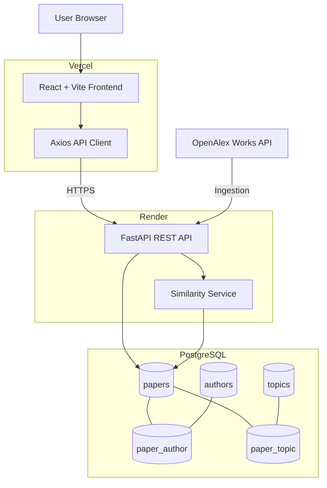
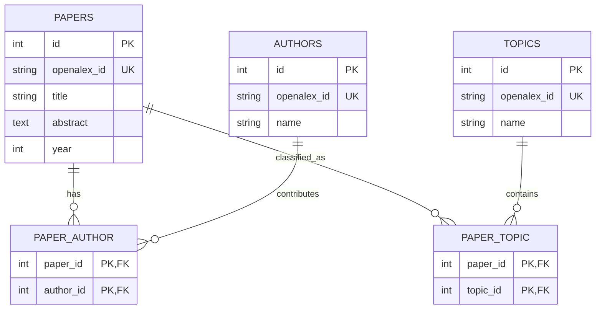
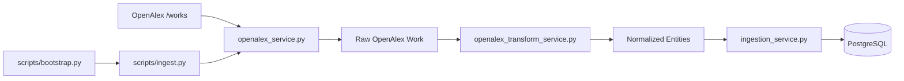
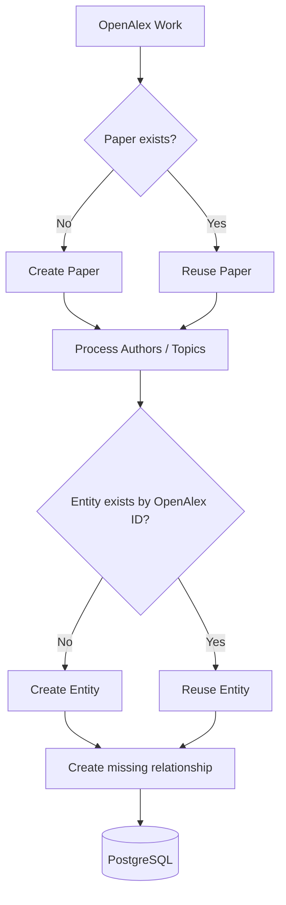
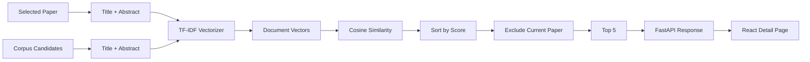
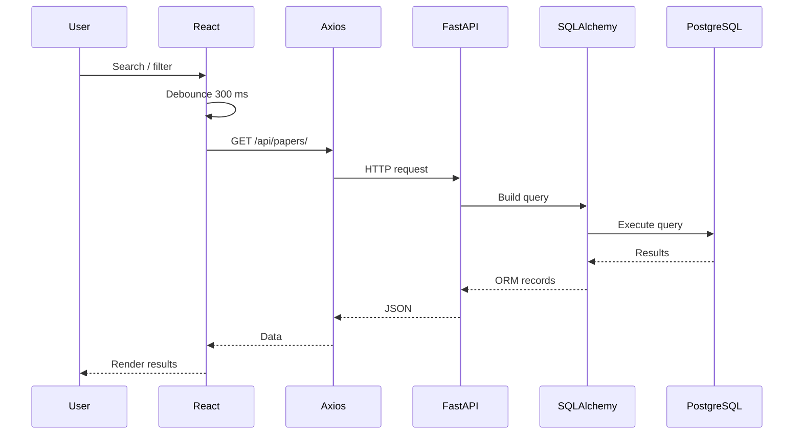
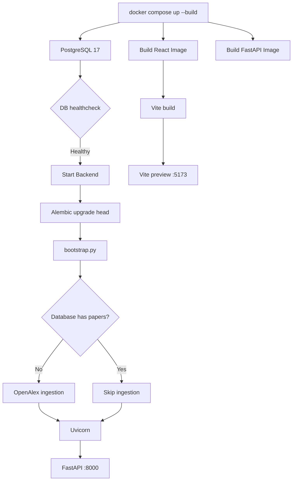
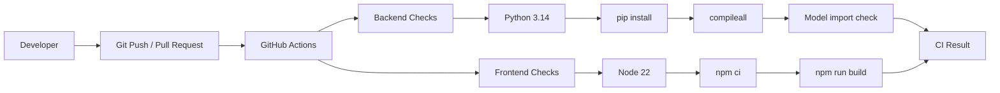
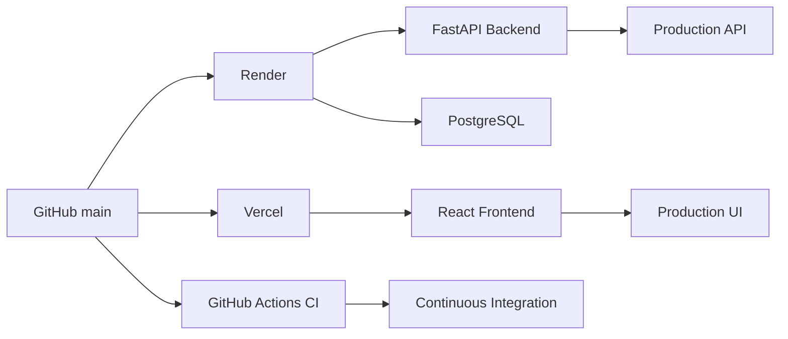
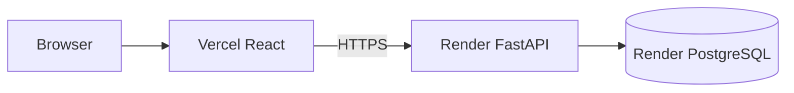

# Research Radar

> A full-stack research discovery platform for searching, filtering,
> exploring, and finding similar research papers.

[](https://github.com/Aztec331/research-radar/actions)

## Live

| Resource | URL |
|---|---|
| **Live Demo** | https://research-radar-teal.vercel.app |
| **Backend API** | https://research-radar-backend.onrender.com |
| **Swagger / OpenAPI Docs** | https://research-radar-backend.onrender.com/docs |
| **GitHub** | https://github.com/Aztec331/research-radar |

------------------------------------------------------------------------

## 1. Overview

Research Radar is a research discovery application built around the
OpenAlex scholarly-data API.

It ingests a corpus of recent research articles for two areas:

-   Natural Language Processing (NLP)
-   Computer Vision

The data is normalized into PostgreSQL, exposed through a FastAPI REST
API, and presented through a React frontend.

The application supports:

-   keyword search across title and abstract;
-   author, topic, and year filtering;
-   pagination;
-   paper detail pages;
-   author/topic metadata;
-   a **Find Similar Papers** feature using TF-IDF and cosine
    similarity.

The project also includes Alembic migrations, Docker Compose
orchestration, automated bootstrap ingestion, GitHub Actions CI, and
public deployment.

------------------------------------------------------------------------

## 2. Architecture

### System architecture



### Responsibilities

| Component | Responsibility |
|---|---|
| React | Search UI, filters, pagination, paper details, similar-paper UI |
| Axios | HTTP communication |
| FastAPI | REST API and request orchestration |
| SQLAlchemy | ORM and database access |
| PostgreSQL | Persistent relational storage |
| OpenAlex | Research data source |
| Ingestion services | Fetch, transform, normalize, persist |
| scikit-learn | TF-IDF and cosine similarity |
| Alembic | Schema migrations |
| Docker Compose | Local orchestration |
| GitHub Actions | Continuous integration |
| Vercel | Frontend hosting |
| Render | Backend/database hosting |

------------------------------------------------------------------------

## 3. Database Design

The schema is normalized around three domain entities: papers, authors,
and topics.

A paper can have many authors and topics, and authors/topics can belong
to many papers. Many-to-many association tables model those
relationships.

### ER diagram



### Tables

| Table | Purpose |
|---|---|
| `papers` | Paper metadata and OpenAlex identity |
| `authors` | Author metadata and OpenAlex identity |
| `topics` | Topic metadata and OpenAlex identity |
| `paper_author` | Paper ↔ Author relationship |
| `paper_topic` | Paper ↔ Topic relationship |

`openalex_id` is unique on papers, authors, and topics.
On authors and topics it is also **nullable**: some OpenAlex records
(notably institutional/group authors) don't carry a stable external ID.
Rather than silently dropping that author from the response — which
would violate the "full detail including authors" requirement — those
records are kept and deduplicated by name instead, with `openalex_id`
left null. Association tables use composite keys and foreign keys.

------------------------------------------------------------------------

## 4. OpenAlex Ingestion Pipeline

OpenAlex was selected because it is a free scholarly-data API and does
not require an API key for this project.

### Pipeline



### Corpus selection

Two OpenAlex searches are used:

```text
"natural language processing"
"computer vision"
```

Each requests up to 200 recent article records, giving a target of up to
approximately 400 records.

The final stored count can be lower because:

-   OpenAlex can return fewer records;
-   records can overlap between topic searches;
-   records without a usable OpenAlex work ID are skipped.

**Synthetic topic labels.** OpenAlex's own topic taxonomy is far more
granular than "NLP" or "Computer Vision" (e.g. "Sentiment Analysis,"
"Image Fusion"). Since the assignment asks for exactly two corpus-level
topics, each paper is also tagged with a synthetic topic
(`custom:nlp` → "NLP", `custom:computer-vision` → "Computer Vision")
reflecting which search batch it came from, alongside OpenAlex's own
granular topics. This keeps the topic filter working correctly for the
two required topics while still preserving OpenAlex's richer
classification data.

### Ingestion flow

1.  Query OpenAlex `/works`.
2.  Request recent `article` records.
3.  Sort by newest publication date.
4.  Transform OpenAlex records into application entities.
5.  Reconstruct OpenAlex inverted-index abstracts.
6.  Create/reuse papers by `openalex_id`.
7.  Create/reuse authors by `openalex_id`.
8.  Create/reuse topics by `openalex_id`.
9.  Create missing association records.
10. Commit to PostgreSQL.

### Idempotency



Unique OpenAlex IDs and application-level existence checks prevent
intentional duplication when ingestion is rerun.

------------------------------------------------------------------------

## 5. API Design

Base API:

```text
https://research-radar-backend.onrender.com
```

Swagger:

```text
https://research-radar-backend.onrender.com/docs
```

### Endpoints

| Method | Endpoint | Purpose |
|---|---|---|
| `GET` | `/` | Database health check |
| `GET` | `/api/papers/` | Search, filter, paginate papers |
| `GET` | `/api/papers/{paper_id}` | Full paper detail |
| `GET` | `/api/ai/papers/{paper_id}/similar` | Return up to five similar papers |

### `GET /api/papers/`

Query parameters:

| Parameter | Description |
|---|---|
| `search` | Case-insensitive title/abstract search |
| `topic` | Topic-name filter |
| `year` | Exact publication year |
| `author` | Case-insensitive author-name filter |
| `page` | Page number, minimum 1 |
| `limit` | Page size, 1-100 |

Example:

```http
GET /api/papers/?search=transformer&topic=NLP&page=1&limit=6
```

Response:

```json
{
  "items": [],
  "total": 0,
  "page": 1,
  "limit": 6
}
```

The query layer uses joins for author/topic filters and `distinct()` to
avoid duplicate papers caused by many-to-many relationships.

### Paper detail

```http
GET /api/papers/{paper_id}
```

Returns the paper's:

-   title;
-   abstract;
-   year;
-   authors;
-   topics.

Missing papers return `404`.

------------------------------------------------------------------------

## 6. Similar Papers

The project's single AI-style feature is **Find Similar Papers**.

It uses a transparent information-retrieval approach rather than an
external LLM.

### Pipeline



### Algorithm

For every similarity request:

1.  Load the selected paper.
2.  Load candidate papers.
3.  Concatenate title and abstract.
4.  Fit `TfidfVectorizer(stop_words="english")`.
5.  Calculate cosine similarity.
6.  Rank candidates descending.
7.  Exclude the selected paper.
8.  Return the top five.

### Why TF-IDF?

TF-IDF was chosen because the assignment corpus is small and the
approach is:

-   deterministic;
-   inexpensive;
-   explainable;
-   local;
-   easy to reproduce;
-   free from external model/API dependencies.

The tradeoff is that TF-IDF is lexical rather than deeply semantic and
runtime vectorization does not scale like a persisted vector index.

------------------------------------------------------------------------

## 7. Frontend

The frontend is built with React, Vite, React Router, Axios, and
Tailwind CSS.

### Routes

```text
/                    → SearchPage
/papers/:paperId     → PaperDetailPage
```

### Search experience

-   Debounced inputs (300 ms).
-   Search across title/abstract.
-   Author filter.
-   Topic filter.
-   Year filter.
-   Pagination.
-   URL query-state persistence.
-   Loading state.
-   Empty state.
-   API error state.
-   Clear filters.

### Detail experience

The paper detail page shows:

-   title;
-   abstract;
-   authors;
-   year;
-   topic;
-   Find Similar Papers action;
-   loading/error states for similarity results.

### Frontend request flow



------------------------------------------------------------------------

## 8. Project Structure

```text
research-radar/
├── .github/
│   └── workflows/
│       └── ci.yml
├── docker-compose.yml
│
├── fastapi-server/
│   ├── app/
│   │   ├── core/
│   │   ├── crud/
│   │   ├── models/
│   │   ├── routes/
│   │   ├── schemas/
│   │   ├── services/
│   │   ├── database.py
│   │   └── main.py
│   ├── alembic/
│   ├── scripts/
│   │   ├── ingest.py
│   │   └── bootstrap.py
│   ├── tests/
│   ├── Dockerfile
│   └── requirements.txt
│
└── react-client/
    ├── src/
    │   ├── api/
    │   ├── components/
    │   └── App.jsx
    ├── Dockerfile
    ├── package.json
    └── vite.config.js
```

------------------------------------------------------------------------

## 9. Technology Stack

### Frontend

-   React 19
-   Vite
-   React Router
-   Axios
-   Tailwind CSS

### Backend

-   Python 3.14
-   FastAPI
-   SQLAlchemy 2
-   Pydantic 2
-   Alembic
-   Uvicorn
-   psycopg 3
-   scikit-learn

### Data

-   PostgreSQL 17
-   OpenAlex Works API

### DevOps

-   Docker
-   Docker Compose
-   GitHub Actions
-   Vercel
-   Render

------------------------------------------------------------------------

## 10. Local Development

### Recommended: Docker

Prerequisites:

-   Docker Desktop
-   Git

Clone:

```bash
git clone https://github.com/Aztec331/research-radar.git
cd research-radar
```

Start:

```bash
docker compose up --build
```

Open:

```text
Frontend: http://localhost:5173
Backend:  http://localhost:8000
Swagger:  http://localhost:8000/docs
```

The stack automatically:

1.  starts PostgreSQL;
2.  waits for the database healthcheck;
3.  runs Alembic migrations;
4.  checks whether papers exist;
5.  runs ingestion if the database is empty;
6.  starts FastAPI;
7.  starts the React/Vite preview server.

The Dockerized frontend is built with:

```yaml
VITE_API_BASE_URL: http://localhost:8000
```

so browser requests reach the host-exposed FastAPI service.

### Native backend

```bash
cd fastapi-server
python -m uvicorn app.main:app --reload
```

The backend requires:

```env
DATABASE_URL=postgresql+psycopg://<user>:<password>@<host>:<port>/<database>
```

### Native frontend

```bash
cd react-client
npm install
npm run dev
```

Set:

```env
VITE_API_BASE_URL=http://localhost:8000
```

------------------------------------------------------------------------

## 11. Docker Design



### Services

| Service | Port | Purpose |
|---|---:|---|
| `db` | 5432 | PostgreSQL 17 |
| `backend` | 8000 | FastAPI |
| `frontend` | 5173 | React/Vite preview |

PostgreSQL uses a named Docker volume for persistence.

The backend waits for the PostgreSQL healthcheck before starting.

------------------------------------------------------------------------

## 12. Database Migrations and Bootstrap

Alembic manages the database schema.

The application does not rely on hand-created tables.

Backend startup runs:

```bash
alembic upgrade head
```

followed by:

```bash
python scripts/bootstrap.py
```

Bootstrap checks:

```text
Does papers table contain records?
        │
   ┌────┴────┐
  No         Yes
   │           │
ingest.py    Skip
```

This prevents normal container restarts from repeatedly ingesting the
corpus.

------------------------------------------------------------------------

## 13. Testing

The repository contains lightweight checks for important backend
functionality.

Current test/check scripts cover:

-   ORM model imports;
-   TF-IDF similarity behavior;
-   OpenAlex transformation;
-   ingestion behavior.

The CI workflow currently runs:

```bash
python -m compileall app scripts
python tests/test_models.py
```

and frontend:

```bash
npm ci
npm run build
```

Full integration and browser coverage are intentionally outside the
current assignment scope.

------------------------------------------------------------------------

## 14. CI/CD

### Continuous Integration

GitHub Actions runs on:

-   pushes to `main`;
-   pull requests targeting `main`.



### Continuous Deployment

Deployment is handled by the connected hosting platforms:



GitHub Actions validates the repository. Render and Vercel perform their
respective deployments from GitHub; the repository workflow itself does
not contain direct Render/Vercel deployment commands.

------------------------------------------------------------------------

## 15. Deployment

### Production request path



The deployed frontend is allowed by FastAPI CORS:

```text
https://research-radar-teal.vercel.app
```

The deployed frontend receives the Render API URL through its Vercel
environment configuration.

### Production links

```text
Frontend:
https://research-radar-teal.vercel.app

Backend:
https://research-radar-backend.onrender.com

Swagger:
https://research-radar-backend.onrender.com/docs
```

------------------------------------------------------------------------

## 16. Design Decisions

### OpenAlex

OpenAlex was chosen over the permitted arXiv alternative because it
provides structured scholarly metadata and can be used without an API
key for this project.

### PostgreSQL

PostgreSQL was chosen because the domain has strong relational structure
and many-to-many relationships.

### Normalized schema

Authors and topics are stored independently rather than duplicated in
every paper row.

This improves:

-   data integrity;
-   filtering;
-   relationship modelling;
-   reuse of author/topic records.

### OpenAlex IDs

OpenAlex identifiers are unique integration keys.

This allows ingestion to detect existing entities and supports
re-runnable ingestion.

### TF-IDF

TF-IDF was selected for similar-paper retrieval because the corpus is
small and the approach is deterministic, explainable, and inexpensive.

### Separate frontend/backend deployment

React and FastAPI can be deployed independently, making Vercel + Render
a natural production topology for this prototype.

------------------------------------------------------------------------

## 17. Tradeoffs

| Choice | Benefit | Tradeoff |
|---|---|---|
| PostgreSQL | Strong relational integrity | Requires joins and schema management |
| OpenAlex keyword search | Simple and free | Search quality depends on OpenAlex |
| OpenAlex IDs | Idempotent entity matching | Existing metadata is not fully reconciled |
| TF-IDF | Fast to implement and explain | Less semantic than embeddings |
| Runtime similarity | No vector DB required | Recomputes vectors per request |
| Bootstrap-on-empty | Simple startup | No scheduled refresh |
| Synchronous SQLAlchemy | Simple architecture | Less suitable for high concurrency |
| Separate hosting | Clear frontend/backend boundary | Requires environment and CORS configuration |
| Lightweight CI | Fast feedback | Does not run full integration tests |

------------------------------------------------------------------------

## 18. Limitations

### Ingestion

-   No retry/backoff strategy for OpenAlex.
-   No scheduled corpus refresh.
-   No ingestion job history.
-   No partial-failure recovery workflow.
-   Topic searches may overlap.

### Similarity

-   TF-IDF is lexical rather than semantic.
-   Vectors are calculated at request time.
-   Similarity scores are not currently returned to the frontend.
-   The approach is not intended for very large corpora.

### Testing

-   No frontend component tests.
-   No full API integration test suite.
-   Docker is not built automatically by CI.
-   External OpenAlex behavior is not mocked in the full application
    pipeline.

### Security / platform

-   Authentication is not implemented because it was outside the
    assignment scope.
-   Local Docker credentials are development credentials and should be
    replaced with secret-managed values for a larger production system.

------------------------------------------------------------------------

## 19. Future Improvements

### Semantic retrieval

Introduce embeddings and PostgreSQL `pgvector` or another vector index:

```text
Paper
  ↓
Embedding model
  ↓
Vector index
  ↓
Nearest-neighbor search
  ↓
Top-K similar papers
```

### Better search

Use PostgreSQL full-text search or a dedicated search engine for
title/abstract retrieval.

### Background ingestion

Introduce scheduled/background ingestion with:

-   retries;
-   exponential backoff;
-   rate-limit handling;
-   incremental updates;
-   ingestion status;
-   failure recovery.

### Stronger testing

Add API integration tests for:

-   pagination;
-   search;
-   filters;
-   paper detail;
-   404 handling;
-   similarity results.

### Production observability

Add:

-   structured logging;
-   metrics;
-   tracing;
-   error tracking;
-   readiness/liveness endpoints.

### Stronger CI

Extend CI to build Docker images and run an integration environment
containing PostgreSQL, FastAPI, migrations, and API tests.

------------------------------------------------------------------------

## 20. Assignment Alignment

| Assignment requirement | Implementation |
|---|---|
| Research discovery tool | React search/detail experience |
| OpenAlex ingestion | OpenAlex service + ingestion pipeline |
| 300-500 recent papers | Up to 200 requested per topic across two topics |
| PostgreSQL | PostgreSQL 17 |
| Custom schema | Papers, authors, topics, associations |
| REST API | FastAPI |
| Pagination | `page` / `limit` |
| Keyword search | Title + abstract |
| Filters | Year, topic, author |
| Paper details | `/api/papers/{id}` |
| AI feature | Find Similar Papers |
| Top five similar papers | TF-IDF + cosine similarity |
| React frontend | React + Vite |
| Debounced search | 300 ms |
| Migrations | Alembic |
| Docker Compose | PostgreSQL + FastAPI + React |
| Loading/error/empty states | Implemented |
| Tests | Backend checks and local test scripts |
| Public deployment | Vercel + Render |
| CI/CD enhancement | GitHub Actions CI + platform deployments |

The assignment specifically asks for setup instructions, design
decisions, tradeoffs, and what would be done next with more time. This
README documents those areas while keeping the scope aligned with the
requested prototype.

------------------------------------------------------------------------

## 21. Assumptions Made

The assignment explicitly invites reasonable assumptions on ambiguous
points, documented here rather than left implicit:

-   **"Two topics of your choice"** was interpreted as two OpenAlex
    search queries used to build the corpus, not a restriction that
    the topic filter can only ever show those two values — the richer
    OpenAlex topic taxonomy is preserved and filterable alongside the
    two corpus-level labels (see §4, Synthetic topic labels).
-   **Author filtering** uses a free-text search input rather than a
    dropdown, since the corpus contains hundreds of distinct author
    names and a dropdown would not be usable at that scale.
-   **AI feature choice:** TF-IDF/cosine similarity was chosen over an
    LLM-based summarization or reviewer-suggestion feature, as it's
    the AI feature most directly relevant to a full-stack/platform
    engineering role and required no external API dependency.
-   **Authors/topics without a stable OpenAlex ID** are kept, not
    skipped, and deduplicated by name instead — to avoid silently
    dropping real data from paper detail responses (see §3).

------------------------------------------------------------------------

## 22. Quick Start

```bash
git clone https://github.com/Aztec331/research-radar.git
cd research-radar
docker compose up --build
```

Open:

```text
http://localhost:5173
```

API:

```text
http://localhost:8000
```

Swagger:

```text
http://localhost:8000/docs
```

------------------------------------------------------------------------

## Project Status

**Production-deployed prototype**

-   Frontend deployed on Vercel
-   Backend deployed on Render
-   PostgreSQL deployed on Render
-   Docker Compose verified end-to-end
-   Alembic migrations automated
-   Initial ingestion automated on an empty database
-   GitHub Actions CI passing
-   Similar-paper feature implemented
-   Swagger/OpenAPI documentation available
